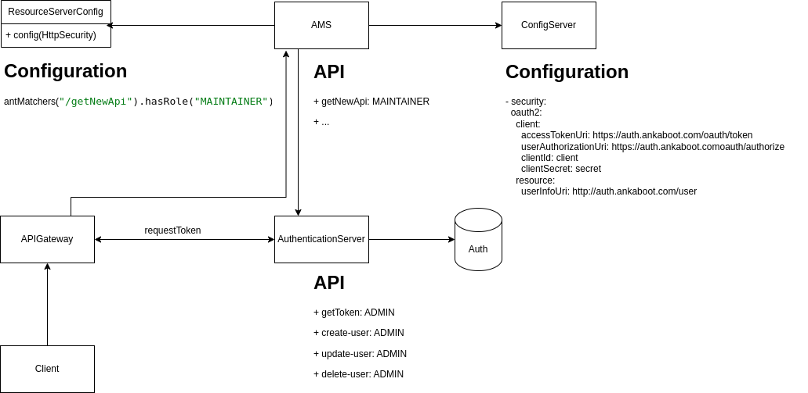

# Overview

Welcome to the Authentication Server! This server is implemented using OAuth 2.0 to provide secure and standardized authentication through all Ankaboot application. It offers various endpoints to handle user-related operations and token management.

##


## How to use Authentication server in local

- clone projects 
  - git@gitlab.com:miu-swa/authenticationserver.git
  - git@gitlab.com:miu-swa/configuration-swa.git

- config authentication server
  - import auth_client to your service application
  ```
    spring:
      config:
        import: auth_client.yml
  ```

- add ResourceConfig

  ```
  @Configuration
  @EnableResourceServer
  public class ResourceServerConfig extends ResourceServerConfigurerAdapter {

    @Override
    public void configure(HttpSecurity http) throws Exception {
      http
          .authorizeRequests()
          .antMatchers("/name").hasAuthority("ADMIN")
          .anyRequest()
          .authenticated();
    }

  }
  ```

- Start Services
  - Configserver
  - Authentication server
  - YOUR_SERVICE


## Endpoints

1. **`/oauth/token`**
    - **Method:** POST
    - **Description:** Obtain an access token for authentication.
    - **Request Parameters:**
        - `grant_type`: The type of grant (e.g., password, client_credentials).
        - `username` (for password grant type): The user's username.
        - `password` (for password grant type): The user's password.
        - `client_id`: The client identifier.
        - `client_secret`: The client secret.

2. **`/user`**
    - **Method:** GET
    - **Description:** Retrieve information about the authenticated user.
    - **Authentication:** Bearer Token in the Authorization header.

3. **`/create-user`**
    - **Method:** POST
    - **Description:** Create a new user account.
    - **Authentication:** Bearer Token in the Authorization header.
    - **Request Body:**
       - `username`: The new user's username.
       - `password`: The new user's password.
       - `roles`: The list user roles.

4. **`/update-user/{user-id}`**
    - **Method:** PUT
    - **Description:** Update the details of the authenticated user.
    - **Authentication:** Bearer Token in the Authorization header.
    - **Request Body:**
      - `username`: The new user's username.
      - `password`: The new user's password.
      - `roles`: The list user roles.

5. **`/delete-user/{user-id}`**
    - **Method:** DELETE
    - **Description:** Delete the authenticated user's account.
    - **Authentication:** Bearer Token in the Authorization header.

> [Postman API sample](https://www.postman.com/samnangan/workspace/samnang-public/collection/28451928-160d8db8-0dde-468a-99d2-ffa43f6ef551?action=share&creator=28451928)

## Predefine Users

### Administrator:
- Username: admin
- Password: 123

### Maintainer:
- Username: maintainer
- Password: 123

### Analyst:
- Username: analyst
- Password: 123

### Client-Secret

   > https://gitlab.com/miu-swa/configserver/-/blob/main/authentication-client-dev.yml

## Getting Started

### Start MongoDB server
> port: 27017

### Interact with the Authentication Server

1. **Get Token:**
    - Use the `/oauth/token` endpoint with the appropriate parameters to obtain an access token.
    - Example Request:
      ```bash
      http://localhost:8080/oauth/token
      
      Authorization: Basic Auth
      Username: <client>
      Password: <secret>
      
      Body: urlencoded
      grant_type:  {password, credential, refresh_token}
      scope: {webclient,mobileclient}
      username: <username>
      password: <password>
      
      ```
    - Example Response:
      ```json
      {
        "access_token": "your_access_token",
        "token_type": "bearer",
        "expires_in": 3600
      }
      ```

2. **Connect with Authentication Server:**
   - Include Authentication server property to your application:
      ```yaml
      spring:
        config:
          import: authentication-client.yml
      ```
## Security Considerations

- Keep your `client_id` and `client_secret` confidential.
- Use HTTPS to secure communication with the Authentication Server.
